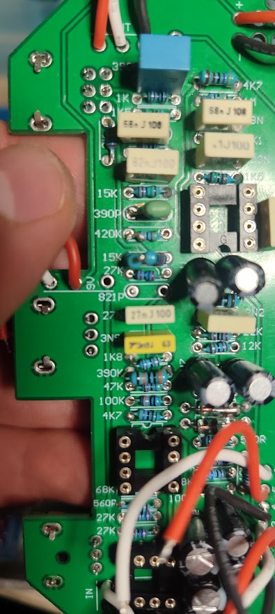
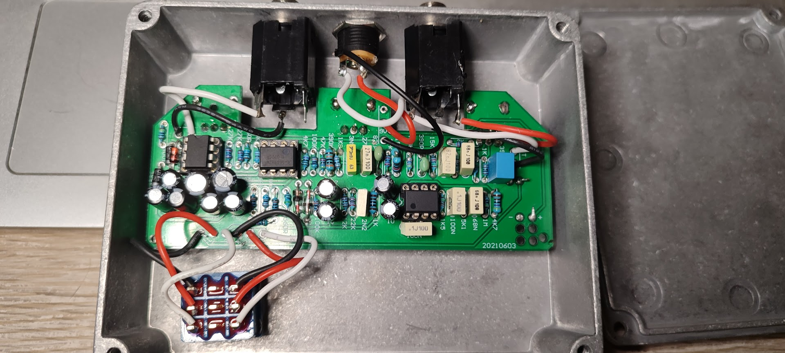
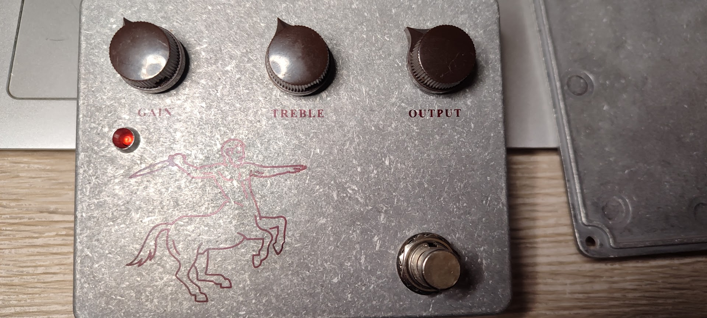

# Analog Signal Processor: Klon Centaur Clone (Manufacturing & Analysis)

## Project Overview
This project documents the end-to-end assembly, quality control, and technical analysis of a high-fidelity analog audio signal processor based on the Klon Centaur circuit. The objective was to execute a reliable **Through-Hole Technology (THT) assembly process** following a strict Control Plan.

> **Project Scope Note:**
> This project was executed in two parallel streams to maximize learning outcomes:
> 1. **Design & Analysis:** The circuit schematics and PCB layout were designed/modeled in **EasyEDA** to study the topology and signal paths.
> 2. **Physical Implementation:** The physical assembly utilized a **standardized component kit** to focus strictly on **THT soldering quality, process control, and FMEA execution**, ensuring a reliable reference for testing.

---

## 1. Engineering Design
*(Technical Documentation & Schematics)*

### Circuit Diagram
Analysis of the dual-ganged summing amplifier topology and charge pump power supply (+18V).

### PCB Layout (Top Layer)
Design optimized for signal integrity and low noise floor.

---

## 2. Manufacturing Process Log
*(Visual documentation of the THT assembly workflow)*

### THT Assembly Phase (PCBA)
Populating low-profile components (Resistors/Diodes) and IC sockets.

### Final Integration & Wiring
Internal view showing off-board wiring, star-grounding implementation, and mechanical assembly.

### Final Product
Completed unit ready for Functional Testing (FNT).

---

## 3. Quality Assurance: FMEA Approach
A **Failure Mode and Effect Analysis (FMEA)** was conducted to anticipate assembly risks (Excerpt from project documentation):

| Process Step | Potential Failure Mode | Risk Priority (RPN) | Mitigation Strategy |
| :--- | :--- | :--- | :--- |
| **Component Insertion** | Polarized Capacitor Reverse | High (81) | Verify stripe orientation before soldering; QC check. |
| **Soldering** | Solder Bridge (Short Circuit) | Medium (64) | Post-solder visual inspection & Flux cleaning. |
| **Wiring** | DC Jack Polarity Inversion | Low (18) | Continuity test with multimeter before powering up. |

---

## Tools & Equipment Used
* **Soldering:** Adjustable Temperature Station (350°C).
* **Measurement:** Digital Multimeter (Continuity, Resistance, Voltage drop).
* **Documentation:** EasyEDA (Schematics), MS Word (Process Flowchart).

---
*Project executed by Andres Guevara Gamboa - University of Pécs*
